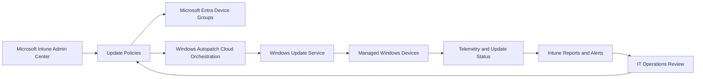
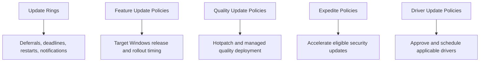

# 🛡️ Microsoft Intune Patch Management

### Enterprise Windows Update Strategy, Deployment Labs, Reporting & Troubleshooting

**A practical, portfolio-ready guide to managing Windows updates with Microsoft Intune, Windows Update for Business and Windows Autopatch.**

[📘 Start Learning](#-learning-path) • [🧪 Hands-on Labs](#-hands-on-labs) • [🛠️ Scripts](#%EF%B8%8F-powershell-toolkit) • [📊 Deployment Blueprint](#-recommended-enterprise-deployment-blueprint)

---

## 📌 Overview

Keeping endpoints secure, stable and compliant requires more than clicking **Deploy**. A reliable patch-management programme combines staged rollout rings, update-specific policies, clear deadlines, user-friendly restart behaviour, monitoring, rollback preparation and documented operational ownership.

Microsoft Intune provides the cloud policy and reporting surface for managing Windows update behaviour. Devices obtain approved update content directly from Windows Update, while Intune and Windows Autopatch coordinate policy, assignment, rollout and reporting.

This repository explains the complete workflow:

- 🔄 Windows update rings and user experience controls
- 🛡️ Monthly quality and security updates
- 🚀 Feature update version management and phased rollouts
- 🔥 Hotpatch for eligible Windows devices
- ⚡ Expedited security update deployments
- 🧩 Driver and firmware update governance
- 🤖 Windows Autopatch concepts and deployment rings
- 📊 Monitoring, compliance reporting and troubleshooting
- 🧪 Guided hands-on labs and reusable PowerShell scripts

> [!IMPORTANT]
> Microsoft changes Intune features, licensing, prerequisites and portal navigation over time. Validate production settings against current Microsoft Learn documentation before deployment.

---

## 🧭 Repository Map

| Area | Purpose |
|---|---|
| [`docs/01-foundations.md`](./docs/01-foundations.md) | Architecture, servicing concepts and prerequisites |
| [`docs/02-update-rings.md`](./docs/02-update-rings.md) | Update-ring design, settings, deadlines and restart experience |
| [`docs/03-quality-updates.md`](./docs/03-quality-updates.md) | Monthly updates, Hotpatch and expedited deployments |
| [`docs/04-feature-updates.md`](./docs/04-feature-updates.md) | Version targeting, safeguards and rollout options |
| [`docs/05-driver-updates.md`](./docs/05-driver-updates.md) | Driver approval, deployment and risk controls |
| [`docs/06-autopatch.md`](./docs/06-autopatch.md) | Windows Autopatch operating model |
| [`docs/07-reporting-monitoring.md`](./docs/07-reporting-monitoring.md) | Reports, metrics and operational monitoring |
| [`docs/08-troubleshooting.md`](./docs/08-troubleshooting.md) | Diagnostic workflow, logs, commands and common failures |
| [`docs/09-best-practices.md`](./docs/09-best-practices.md) | Enterprise recommendations and production checklist |
| [`labs/`](./labs/) | Five end-to-end practical labs |
| [`scripts/`](./scripts/) | PowerShell inventory and troubleshooting utilities |

---

## 🧠 Quality Updates vs Feature Updates

| Category | 🛡️ Quality Update | 🚀 Feature Update |
|---|---|---|
| Primary purpose | Security fixes, reliability fixes and servicing improvements | Upgrade Windows to a newer release and capability set |
| Typical cadence | Monthly cumulative release, plus out-of-band updates when required | Periodic Windows release lifecycle |
| Size and impact | Usually smaller and faster | Larger download, compatibility and readiness impact |
| New features | Normally no major new Windows version features | Introduces platform features, UI and behavioural changes |
| Deployment approach | Regular rings; expedite critical security fixes when justified | Pilot, validate, then gradually expand |
| Testing focus | Boot, security tooling, line-of-business apps, VPN and core productivity | Hardware readiness, application compatibility, drivers, add-ins and user experience |

---

## 🏗️ How Intune Patch Deployment Works

### Core policy layers

---

## 🎯 Recommended Enterprise Deployment Blueprint

| Ring | Example population | Purpose | Suggested approach |
|---|---:|---|---|
| 🧪 Ring 0 – Validation | IT lab and test VMs | Confirm policy delivery and basic installation | Earliest availability; tight monitoring |
| 👨‍💻 Ring 1 – IT Pilot | IT staff and technical champions | Detect operational, VPN, security and admin-tool issues | Early deployment with short deadline |
| 👥 Ring 2 – Business Pilot | Representative users from each department | Validate business applications and real workflows | Controlled rollout after IT validation |
| 🏢 Ring 3 – Broad Production | Most corporate devices | Standard enterprise deployment | Phased availability with enforced deadline |
| 🛟 Ring 4 – Critical/Special | Kiosks, shared devices, executive or sensitive workloads | Separate risk and maintenance requirements | Dedicated scheduling, ownership and rollback plan |

> [!TIP]
> Use device-based Microsoft Entra security groups for update assignments where predictable device targeting is required. Avoid overlapping policies that configure the same settings differently.

---

## 📚 Learning Path

1. **Foundations:** understand Windows servicing, policy responsibilities and prerequisites.
2. **Update rings:** configure baseline delivery, deadlines and restart behaviour.
3. **Quality updates:** establish the monthly security patch process.
4. **Feature updates:** control Windows version targeting and phased deployment.
5. **Drivers:** approve hardware updates with a conservative governance model.
6. **Autopatch:** understand service-managed rings and cloud orchestration.
7. **Reporting:** define compliance measures, alerts and remediation ownership.
8. **Troubleshooting:** investigate scan, download, installation and restart failures.
9. **Production readiness:** apply the checklist before broad deployment.

➡️ Begin with **[Patch Management Foundations](./docs/01-foundations.md)**.

---

## 🧪 Hands-on Labs

| Lab | Scenario | Outcome |
|---|---|---|
| [Lab 01](./labs/lab-01-create-update-rings.md) | Create pilot and production update rings | Staged update baseline with controlled restart behaviour |
| [Lab 02](./labs/lab-02-feature-update-deployment.md) | Deploy a targeted Windows feature release | Version-controlled phased deployment |
| [Lab 03](./labs/lab-03-expedite-security-update.md) | Expedite an eligible security update | Emergency patch workflow with monitoring |
| [Lab 04](./labs/lab-04-driver-update-policy.md) | Review and approve Windows drivers | Controlled driver deployment process |
| [Lab 05](./labs/lab-05-monitor-and-troubleshoot.md) | Monitor compliance and diagnose failures | Evidence-based troubleshooting workflow |

---

## 🛠️ PowerShell Toolkit

| Script | Purpose |
|---|---|
| [`Get-WindowsUpdateReadiness.ps1`](./scripts/Get-WindowsUpdateReadiness.ps1) | Collect OS, build, reboot and Windows Update service readiness |
| [`Get-WindowsUpdateHistory.ps1`](./scripts/Get-WindowsUpdateHistory.ps1) | Export recent Windows Update history |
| [`Get-IntuneDiagnostics.ps1`](./scripts/Get-IntuneDiagnostics.ps1) | Gather core Intune and Windows Update diagnostic evidence |
| [`Test-WindowsUpdateEndpoints.ps1`](./scripts/Test-WindowsUpdateEndpoints.ps1) | Test essential HTTPS connectivity used during investigation |

> [!CAUTION]
> Test all scripts in a non-production environment. Review their output for sensitive device, tenant or user information before sharing diagnostic bundles.

---

## ✅ Success Measures

A mature patch-management service should track more than “policy assigned”. Useful measures include:

- Percentage of active devices on the required quality-update level
- Feature-version adoption by deployment ring
- Median time from release to compliant installation
- Failure rate by update, hardware model and ring
- Devices pending restart beyond the agreed threshold
- Devices inactive or not checking in
- Safeguard holds and compatibility blocks
- Expedited-update coverage during security incidents
- Helpdesk incidents and user disruption caused by updates

---

## 🔐 Security and Operational Principles

- Apply least privilege for Intune administrative roles.
- Use separate pilot and production assignments.
- Maintain tested recovery and rollback procedures.
- Do not bypass safeguard holds without documented risk acceptance and validation.
- Coordinate updates with application owners, security operations and service desk teams.
- Record exceptions with owner, reason, expiry date and compensating controls.
- Keep device inventory, ownership and lifecycle status accurate.

---

## 📖 Official References

- [Microsoft Intune device updates](https://learn.microsoft.com/intune/device-updates/)
- [Manage Windows update rings](https://learn.microsoft.com/intune/device-updates/windows/manage-update-rings)
- [Manage Windows feature updates](https://learn.microsoft.com/intune/device-updates/windows/feature-updates)
- [Manage Windows quality updates](https://learn.microsoft.com/intune/device-updates/windows/quality-updates)
- [Manage Windows driver updates](https://learn.microsoft.com/intune/device-updates/windows/manage-driver-updates)
- [Microsoft Intune reports](https://learn.microsoft.com/intune/device-management/reports/overview)

---

## 🤝 Contributing

Contributions, issue reports and documentation improvements are welcome. Read [`CONTRIBUTING.md`](./CONTRIBUTING.md) before submitting changes.

## ⚖️ Disclaimer

This repository is an independent educational project and is not affiliated with or endorsed by Microsoft. Product names and trademarks belong to their respective owners. Always verify current requirements and settings in official Microsoft documentation before production use.

---

### 👨‍💻 Author

**Xuan Toan Nguyen**  
Systems Administrator & ICT Support Professional • Adelaide, South Australia  
Microsoft Certified: Azure Fundamentals • WorldSkills SA 2026 Silver Medalist – Cloud Computing

⭐ Star this repository if it supports your Intune learning journey.

[⬆ Back to Top](#%EF%B8%8F-microsoft-intune-patch-management)

**#ToanNguyenITOz**

