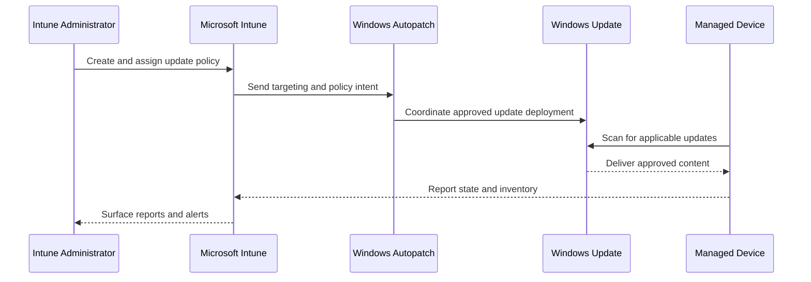

<div align="center">

# 🧱 Patch Management Foundations

[](../README.md) [](https://learn.microsoft.com/intune/)

**Architecture • Update types • Responsibilities • Prerequisites**

[🏠 Home](../README.md) • [➡️ Next: Update Rings](./02-update-rings.md)

</div>

---

## 🎯 Learning Objectives

By the end of this module, you should be able to:

- Explain the role of Intune, Windows Autopatch and Windows Update.
- Distinguish update rings from feature, quality and driver update policies.
- Identify the technical and operational prerequisites for cloud update management.
- Build a basic responsibility model for an enterprise patching service.

---

## 🏗️ Service Architecture

Intune stores policy configuration and assignments. Windows Autopatch cloud orchestration coordinates supported update workflows, while Windows Update evaluates applicability and delivers content directly to devices.



---

## 🧩 Policy Responsibilities

| Policy type | Primary responsibility | Typical use |
|---|---|---|
| Update rings | Client update behaviour | Deferrals, deadlines, active hours, restart notifications and user experience |
| Feature update policy | Windows release targeting | Hold devices at a supported release or move them to a newer version |
| Quality update policy | Managed quality-update scenarios | Cloud-orchestrated quality updates and Hotpatch where eligible |
| Expedite policy | Emergency acceleration | Rapid deployment of an eligible Windows security update |
| Driver update policy | Driver approval and scheduling | Review, approve, pause and deploy applicable drivers |
| Autopatch groups | Service-managed phased deployment | Dynamic grouping and staged rollout under Windows Autopatch |

> [!NOTE]
> Update rings and update-specific policies complement one another. For example, a feature update policy controls **which Windows release** is offered, while the update ring still influences deadlines and restart behaviour.

---

## 🔄 Windows Servicing Concepts

### Quality updates

Quality updates are cumulative servicing releases that normally include security, reliability and bug fixes. A current cumulative update supersedes earlier updates for the same Windows release.

### Feature updates

Feature updates move a device to a newer Windows release. They have a larger compatibility and readiness impact and should be deployed through controlled stages.

### Driver updates

Windows Update can deliver applicable hardware drivers. Intune driver policies provide approval control so administrators can evaluate risk before broad deployment.

### Hotpatch

Hotpatch applies eligible security fixes without requiring an immediate restart for each monthly update. Eligibility depends on supported Windows editions, versions, licensing and device configuration.

### Expedited updates

An expedite policy accelerates a supported Windows security update and can override normal deferral timing. It is intended for urgent, targeted situations rather than routine monthly patching.

---

## ✅ Technical Prerequisites Checklist

- [ ] Devices are enrolled in Intune or correctly co-managed.
- [ ] Supported Windows edition and version are in use.
- [ ] Devices have internet access to required Intune, Windows Update and Autopatch endpoints.
- [ ] Windows Update service is available and not disabled by legacy configuration.
- [ ] Required Intune licences and feature-specific licensing are assigned.
- [ ] Microsoft Entra device groups exist for pilot and production targeting.
- [ ] Administrative roles follow least privilege.
- [ ] Conflicting Group Policy, Configuration Manager or registry settings have been reviewed.
- [ ] Delivery Optimization and proxy behaviour have been planned.
- [ ] Recovery keys and endpoint backup expectations are documented.

---

## 👥 Operating Model

| Role | Key responsibilities |
|---|---|
| Endpoint Engineering | Design policies, rings, assignments and technical standards |
| Security Operations | Assess urgency, vulnerabilities and exception risk |
| Service Desk | Handle user communication, restart issues and first-line diagnostics |
| Application Owners | Validate business-critical applications and add-ins |
| Network Team | Confirm proxy, firewall and content-delivery readiness |
| Change Management | Coordinate approvals, maintenance windows and stakeholder communication |
| Business Owners | Approve exceptions for critical workloads |

---

## 📋 Minimum Patch Policy Standard

A useful enterprise standard should define:

1. Supported Windows versions and end-of-service handling.
2. Ring membership and promotion criteria.
3. Quality-update deployment targets.
4. Feature-update cadence and testing requirements.
5. Emergency expedite authority and approval path.
6. Driver approval rules.
7. Restart deadlines and user communications.
8. Monitoring frequency and compliance targets.
9. Exception process, owner and expiry date.
10. Rollback, recovery and incident escalation procedures.

---

## 🧪 Readiness Validation

Before production rollout, validate:

```powershell
Get-ComputerInfo | Select-Object WindowsProductName, WindowsVersion, OsBuildNumber
Get-Service wuauserv, bits, usosvc | Select-Object Name, Status, StartType
Get-Tpm
Get-BitLockerVolume
```

Also confirm that the device appears in Intune, checks in successfully, receives policy and can scan Windows Update.

---

## 🔗 Official References

- [Microsoft Intune device updates](https://learn.microsoft.com/intune/device-updates/)
- [Windows update management overview](https://learn.microsoft.com/intune/device-updates/windows/)
- [Windows Update for Business deployment service](https://learn.microsoft.com/windows/deployment/update/deployment-service-overview)

---

<div align="center">

[⬅️ README](../README.md) • [⬆ Back to Top](#-patch-management-foundations) • [➡️ Update Rings](./02-update-rings.md)

**Maintained by [Xuan Toan Nguyen](https://github.com/toannguyenitoz) • Adelaide, Australia • #ToanNguyenITOz**

</div>
