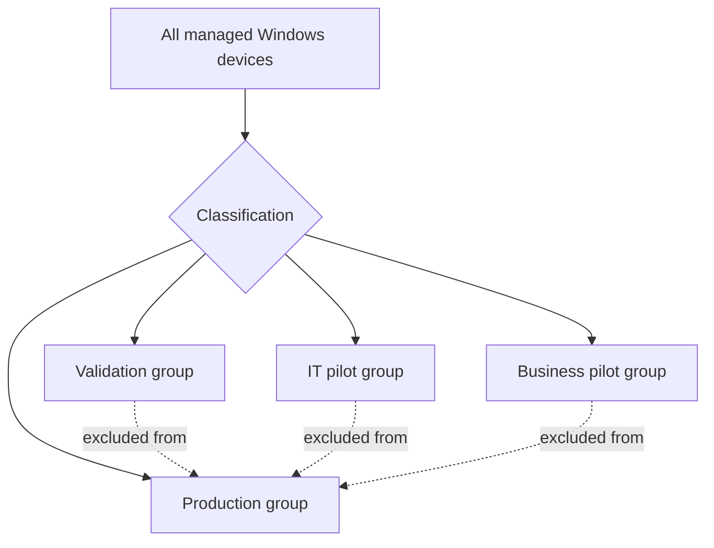

<div align="center">

# 🔄 Windows Update Rings

[](../README.md) [](https://learn.microsoft.com/intune/device-updates/windows/manage-update-rings)

**Deferrals • Deadlines • Restarts • Notifications • Deployment stages**

[⬅️ Foundations](./01-foundations.md) • [🏠 Home](../README.md) • [➡️ Quality Updates](./03-quality-updates.md)

</div>

---

## 📌 What an Update Ring Controls

Update rings define client-side Windows Update behaviour. They are commonly used to create test, pilot and production stages and can coexist with feature, quality and driver update policies.

Typical controls include:

- Quality and feature update deferrals
- Automatic update behaviour
- Active hours and restart handling
- Installation deadlines and grace periods
- Restart warnings and user notifications
- Microsoft product updates
- Driver inclusion or exclusion
- Pause and uninstall periods where supported

> [!IMPORTANT]
> When a dedicated feature update policy controls the target Windows version, avoid adding unnecessary feature-update deferrals in update rings. Overlapping controls can delay or block the intended offer.

---

## 🏗️ Recommended Ring Design

| Ring | Target group | Quality update timing | Deadline concept | Monitoring |
|---|---|---|---|---|
| Ring 0 – Validation | Lab devices and test VMs | Immediate or earliest | Short | Daily during release window |
| Ring 1 – IT Pilot | IT staff | Early | Short to moderate | Daily |
| Ring 2 – Business Pilot | Representative users | After IT validation | Moderate | Every 1–2 days |
| Ring 3 – Production | Most managed devices | After pilot confidence | Enforced organisational standard | Weekly plus release-window review |
| Ring 4 – Special | Sensitive or operationally constrained devices | Dedicated schedule | Workload-specific | Owner-controlled |

The exact delay values should reflect business risk, patch severity, device connectivity and support capacity. Do not copy arbitrary numbers into production without validating them.

---

## ⚙️ Configuration Walkthrough

1. Open the **Microsoft Intune admin center**.
2. Go to **Devices → Windows updates → Update rings**.
3. Select **Create profile**.
4. Enter a descriptive name, such as `WUfB-Ring-01-IT-Pilot`.
5. Configure update settings.
6. Configure user-experience settings.
7. Assign the profile to a device group.
8. Review the scope and create the policy.
9. Monitor deployment state before expanding the assignment.

### Naming convention

```text
WUfB-Ring-<sequence>-<population>-<environment>
```

Examples:

```text
WUfB-Ring-00-Validation-Prod
WUfB-Ring-01-ITPilot-Prod
WUfB-Ring-02-BusinessPilot-Prod
WUfB-Ring-03-Broad-Prod
```

---

## ⏰ Deadlines, Grace Periods and Active Hours

A well-designed policy balances security compliance with user productivity.

### Deadline

The deadline defines how long an update can remain pending before enforcement. Use a shorter deadline for critical security exposure and a measured deadline for broad production deployment.

### Grace period

A grace period can provide extra time after the deadline before a restart is forced. This is useful for devices that were offline or were unable to complete installation earlier.

### Active hours

Active hours reduce disruptive automatic restarts during expected working time. They do not replace a deadline and should not allow a device to remain unpatched indefinitely.


---

## 👤 User Experience Recommendations

- Give users clear restart notifications.
- Avoid hiding all notifications unless a tightly controlled kiosk scenario requires it.
- Explain what happens when a deadline expires.
- Provide a self-service restart window where practical.
- Coordinate with service desk before changing restart behaviour.
- Test laptop sleep, VPN and remote-user scenarios.
- Consider shared devices separately from one-to-one assigned devices.

---

## ⚠️ Assignment and Conflict Risks

Common causes of unexpected behaviour include:

- A device belongs to multiple rings with conflicting settings.
- Group Policy configures the same Windows Update CSP settings.
- Configuration Manager still owns the Windows Update workload.
- Feature deferrals conflict with a dedicated feature update policy.
- A policy targets users while another targets devices.
- Exclusion groups are not evaluated as expected.
- A stale device object remains in a production group.

### Safe assignment pattern



---

## ✅ Ring Validation Checklist

- [ ] Policy name clearly identifies stage and purpose.
- [ ] Assignment uses the intended device group.
- [ ] Pilot groups are excluded from the broad ring where required.
- [ ] Deadlines and notifications were tested.
- [ ] Feature deferral does not conflict with a feature update policy.
- [ ] Driver setting aligns with the driver-policy strategy.
- [ ] Monitoring owner and promotion criteria are documented.
- [ ] Service desk has the deployment schedule and user message.

---

## 📊 Promotion Criteria

Promote an update to the next ring only when:

- Installation success is within the agreed threshold.
- No widespread boot, VPN, security-agent or business-app failures exist.
- Restart behaviour is acceptable.
- No unresolved high-severity incident is linked to the update.
- Application owners have completed required validation.
- Reporting data is sufficiently current to support the decision.

---

## 🔗 Official References

- [Manage Windows update ring policies](https://learn.microsoft.com/intune/device-updates/windows/manage-update-rings)
- [Update ring policy settings](https://learn.microsoft.com/intune/device-updates/windows/ref-update-ring-settings)
- [Windows update reports](https://learn.microsoft.com/intune/device-updates/windows/monitor-update-rings)

---

<div align="center">

[⬅️ Foundations](./01-foundations.md) • [⬆ Back to Top](#-windows-update-rings) • [➡️ Quality Updates](./03-quality-updates.md)

**Maintained by [Xuan Toan Nguyen](https://github.com/toannguyenitoz) • #ToanNguyenITOz**

</div>
