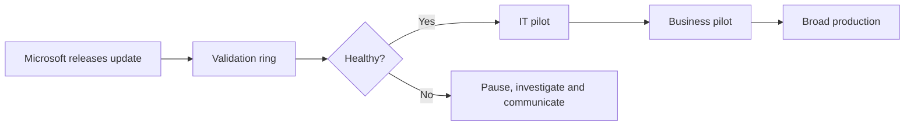

# 🛡️ Quality Updates, Hotpatch & Expedite

 

**Monthly servicing • Emergency patching • Restart reduction**

[⬅️ Update Rings](./02-update-rings.md) • [🏠 Home](../README.md) • [➡️ Feature Updates](./04-feature-updates.md)

---

## 📌 Quality Update Strategy

Windows quality updates are cumulative and normally contain security fixes, reliability improvements and bug fixes. Standard monthly deployment should be predictable, staged and measured.

A dedicated quality update policy is not required merely for devices to receive normal monthly updates. Update rings can control standard Windows Update behaviour. Quality update policies are useful for advanced cloud-orchestrated scenarios such as policy-based reporting, Hotpatch and Autopatch-managed workflows.

---

## 🔥 Hotpatch

Hotpatch can apply eligible security updates without requiring an immediate reboot for every monthly release. Periodic baseline updates can still require a restart.

### Benefits

- Reduces restart frequency for eligible updates.
- Shortens exposure time to supported security fixes.
- Improves availability for supported user and workload scenarios.

### Validate before enabling

- Supported Windows edition and release
- Required subscription or licence
- Intune enrolment and cloud connectivity
- Current baseline and servicing state
- Compatibility with organisational security controls

> [!WARNING]
> Do not describe Hotpatch as “never reboot”. Baseline, non-Hotpatch and other update types may still require restarts.

---

## ⚡ Expedite Update Deployment

Expedite policies are designed for urgent, targeted deployment of eligible Windows security updates. They override normal quality-update deferrals but do not redefine future monthly deployment behaviour.

### Appropriate use cases

- Active exploitation or severe security exposure
- A critical vulnerability affecting a high-value device group
- Security incident response requiring accelerated remediation

### Emergency workflow

1. Security validates severity, exposure and update eligibility.
2. Endpoint Engineering identifies a small validation group.
3. Create the expedite policy and configure the restart deadline.
4. Assign the validation group and monitor.
5. Expand to affected production groups after confidence is established.
6. Track failures, pending restarts and inactive devices.
7. Close the emergency change with evidence and lessons learned.

---

## 📋 Monthly Patch Runbook

### Before release

- Confirm ring membership and exclusions.
- Review unsupported and end-of-service Windows versions.
- Validate service desk communications and escalation contacts.
- Check critical business periods and change freezes.

### Release week

- Monitor validation and IT pilot devices.
- Review known issues and safeguard information.
- Confirm VPN, security agent, browser, Office and line-of-business applications.

### Broad deployment

- Promote only after agreed criteria are met.
- Track failures by model, build and error code.
- Contact owners of inactive or non-compliant devices.

### Closure

- Record compliance, exceptions and incidents.
- Review devices that exceeded deadlines.
- Update knowledge articles and automation opportunities.

---

## ✅ Quality Update Checklist

- [ ] Pilot and production groups are separate.
- [ ] Deadline and grace period are documented.
- [ ] Restart notifications are user-tested.
- [ ] Critical applications have validation owners.
- [ ] Emergency expedite authority is defined.
- [ ] Hotpatch eligibility is verified rather than assumed.
- [ ] Reports are reviewed until the release is operationally closed.

---

## 🔗 Official References

- [Manage Windows quality updates](https://learn.microsoft.com/intune/device-updates/windows/quality-updates)
- [Configure expedite policies](https://learn.microsoft.com/intune/device-updates/windows/configure-expedite-policy)
- [Monitor quality updates](https://learn.microsoft.com/intune/device-updates/windows/monitor-quality-updates)

---

[⬅️ Update Rings](./02-update-rings.md) • [⬆ Back to Top](#%EF%B8%8F-quality-updates-hotpatch--expedite) • [➡️ Feature Updates](./04-feature-updates.md)

**Maintained by [Xuan Toan Nguyen](https://github.com/toannguyenitoz) • #ToanNguyenITOz**

