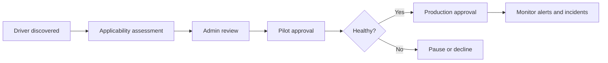

# 🧩 Windows Driver Updates

 

**Approval • Applicability • Deployment • Rollback planning**

[⬅️ Feature Updates](./04-feature-updates.md) • [🏠 Home](../README.md) • [➡️ Windows Autopatch](./06-autopatch.md)

---

## 📌 Why Govern Driver Updates?

Drivers can improve security, stability and hardware compatibility, but a faulty display, storage, network or firmware-related driver can also cause widespread disruption. Intune driver update policies allow administrators to review and control applicable drivers delivered through Windows Update.

Windows Update evaluates device hardware and installs only approved drivers that are applicable and newer than the installed version.

---

## ⚙️ Approval Models

| Model | Behaviour | Best fit |
|---|---|---|
| Automatic approval | Newly applicable recommended drivers are approved according to policy behaviour | Standardised fleets with mature pilot controls |
| Manual approval | New drivers remain pending review until an administrator approves them | Higher-risk environments or diverse hardware fleets |

A conservative enterprise approach often starts with manual approval, then introduces selective automation after operational confidence improves.

---

## 🏗️ Driver Deployment Workflow

### Review criteria

- Driver class and affected component
- Vendor and version
- Hardware models in scope
- Security relevance
- Known issues and vendor release notes
- Existing incident history
- Rollback availability
- Need for restart or firmware dependency

---

## 🧪 Suggested Test Matrix

| Component | Validation |
|---|---|
| Network adapter | Wi-Fi, Ethernet, VPN, sleep/resume and docking station |
| Display adapter | Multiple monitors, resolution, video conferencing and sleep/resume |
| Audio | Headset, Bluetooth, microphone and conferencing applications |
| Storage | Boot, BitLocker, performance and recovery environment |
| Chipset | Docking, USB, power management and device enumeration |
| Printer | Corporate print queues and specialised applications |

---

## ⚠️ Risk Controls

- Deploy to representative hardware pilots first.
- Separate firmware and high-impact drivers from low-risk peripheral updates.
- Keep vendor rollback packages or recovery media available.
- Record approval date, approver and business reason.
- Monitor helpdesk incidents by hardware model and driver version.
- Pause deployment quickly when a pattern emerges.
- Avoid approving every listed driver merely to clear the review queue.

---

## ✅ Driver Policy Checklist

- [ ] Device groups represent the actual hardware fleet.
- [ ] Pilot devices include each major model and docking scenario.
- [ ] Approval ownership is defined.
- [ ] Vendor release information is reviewed.
- [ ] Rollback steps are documented.
- [ ] Driver update alerts are monitored.
- [ ] Firmware and BIOS dependencies are considered.
- [ ] Broad deployment follows successful pilot evidence.

---

## 🔗 Official References

- [Manage Windows driver updates](https://learn.microsoft.com/intune/device-updates/windows/manage-driver-updates)
- [Configure driver update policies](https://learn.microsoft.com/intune/device-updates/windows/driver-update-policy)
- [Microsoft Intune reports overview](https://learn.microsoft.com/intune/device-management/reports/overview)

---

[⬅️ Feature Updates](./04-feature-updates.md) • [⬆ Back to Top](#-windows-driver-updates) • [➡️ Windows Autopatch](./06-autopatch.md)

**Maintained by [Xuan Toan Nguyen](https://github.com/toannguyenitoz) • #ToanNguyenITOz**

