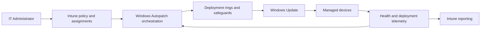

# 🤖 Windows Autopatch

 

**Cloud orchestration • Deployment rings • Health monitoring • Service-managed operations**

[⬅️ Driver Updates](./05-driver-updates.md) • [🏠 Home](../README.md) • [➡️ Reporting](./07-reporting-monitoring.md)

---

## 📌 What Windows Autopatch Adds

Windows Autopatch is a cloud service integrated with Intune that helps manage Windows updates through service-managed deployment capabilities. Depending on the feature and licensing model, it can add dynamic grouping, phased rollouts, safeguards, health monitoring and reporting.

Intune remains the administrative policy surface. Windows Update delivers update content to devices.

---

## 🏗️ Operating Model

---

## 🧭 Autopatch Groups

Autopatch groups support staged rollout by organising devices into deployment rings. A good group design still requires accurate inventory, representative pilot devices and documented exception handling.

Suggested principles:

- Include a small, technically capable validation population.
- Include representative hardware and business applications in early rings.
- Keep critical or unusual workloads in a separately governed population.
- Review dynamic group logic and device distribution regularly.
- Ensure stale and retired devices are removed from operational reporting.

---

## 🔄 Shared Responsibility

| Microsoft cloud service | Customer organisation |
|---|---|
| Provides update orchestration capabilities | Maintains supported and healthy devices |
| Uses Windows ecosystem signals and safeguards | Validates business applications and specialist hardware |
| Surfaces update status and alerts | Monitors reports and responds to failures |
| Coordinates supported policy workflows | Maintains identities, licences, network access and assignments |
| Delivers service improvements | Manages change, communications, exceptions and incidents |

> [!IMPORTANT]
> Autopatch reduces manual orchestration but does not remove organisational responsibility for readiness, application compatibility, helpdesk support or recovery.

---

## ✅ Adoption Checklist

- [ ] Licensing and supported cloud requirements are confirmed.
- [ ] Required endpoints are reachable.
- [ ] Device enrolment and identity health are verified.
- [ ] Existing update rings and legacy GPOs are reviewed.
- [ ] Ring populations include representative devices.
- [ ] Application owners know the pilot schedule.
- [ ] Helpdesk and incident procedures are ready.
- [ ] Reporting ownership and compliance targets are defined.
- [ ] Exception and rollback processes are documented.

---

## 🔗 Official References

- [Windows Autopatch documentation](https://learn.microsoft.com/windows/deployment/windows-autopatch/)
- [Windows update management overview](https://learn.microsoft.com/intune/device-updates/windows/)
- [Windows updates API overview](https://learn.microsoft.com/graph/windowsupdates-concept-overview)

---

[⬅️ Driver Updates](./05-driver-updates.md) • [⬆ Back to Top](#-windows-autopatch) • [➡️ Reporting](./07-reporting-monitoring.md)

**Maintained by [Xuan Toan Nguyen](https://github.com/toannguyenitoz) • #ToanNguyenITOz**

