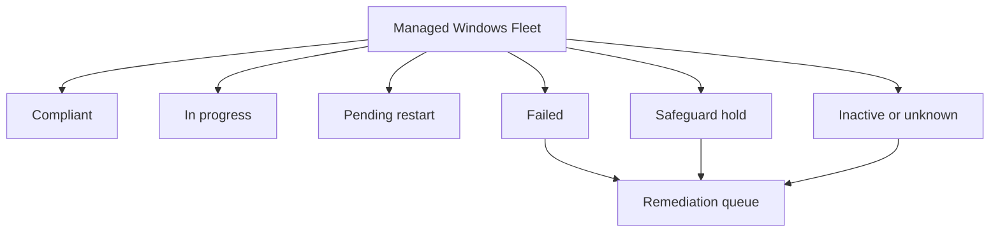

# 📊 Reporting & Monitoring

 

**Compliance • Deployment status • Alerts • Operational metrics**

[⬅️ Autopatch](./06-autopatch.md) • [🏠 Home](../README.md) • [➡️ Troubleshooting](./08-troubleshooting.md)

---

## 🎯 Monitoring Goals

Monitoring should answer four questions:

1. Did the correct devices receive the intended policy?
2. Did Windows offer and install the expected update?
3. Which devices are blocked, failed, inactive or awaiting restart?
4. What action and owner are required next?

---

## 📑 Key Report Categories

| Report area | Use |
|---|---|
| Deployment status per update ring | Review success and failure by ring |
| Feature update organisational report | Track offer, installation and version status |
| Feature update failures | Investigate operational failures |
| Windows update distribution | Understand quality-update coverage by Windows version |
| Expedited update failures | Identify devices failing urgent deployments |
| Driver update alerts | Review driver policy problems and affected devices |
| Device configuration status | Confirm policy assignment and CSP processing |

---

## 📈 Suggested Dashboard Measures

Recommended measures:

- Current quality-update coverage
- Target feature-version adoption
- Success rate by deployment ring
- Failure rate by hardware model and update
- Devices awaiting restart beyond threshold
- Devices not checking in within the agreed period
- Expedite completion during emergency response
- Open exceptions and expiry dates

---

## 🗓️ Monitoring Cadence

| Stage | Cadence |
|---|---|
| Validation and IT pilot | Daily during the release window |
| Business pilot | Daily or every two business days |
| Broad production | At least weekly, more frequently during rollout |
| Emergency expedite | Several operational reviews per day until risk is controlled |
| Feature update programme | Weekly governance review until closure |

---

## 🧾 Evidence Record

For each release, retain:

- Update or target version
- Policy names and assignments
- Change record reference
- Ring promotion dates
- Compliance snapshots
- Known issues and decisions
- Exceptions, owners and expiry dates
- Incidents linked to the update
- Final closure summary

---

## ✅ Monitoring Checklist

- [ ] Report data freshness is understood.
- [ ] Inactive devices are separated from active failures.
- [ ] Pending restart is tracked independently.
- [ ] Failure patterns are grouped by model, build and error.
- [ ] Owners and remediation due dates are assigned.
- [ ] Exceptions have an expiry date.
- [ ] Broad rollout decisions are evidence-based.

---

## 🔗 Official References

- [Microsoft Intune reports](https://learn.microsoft.com/intune/device-management/reports/overview)
- [Quality update reports](https://learn.microsoft.com/intune/device-updates/windows/monitor-quality-updates)
- [Feature update reports](https://learn.microsoft.com/intune/device-updates/windows/feature-update-reports)

---

[⬅️ Autopatch](./06-autopatch.md) • [⬆ Back to Top](#-reporting--monitoring) • [➡️ Troubleshooting](./08-troubleshooting.md)

**Maintained by [Xuan Toan Nguyen](https://github.com/toannguyenitoz) • #ToanNguyenITOz**

