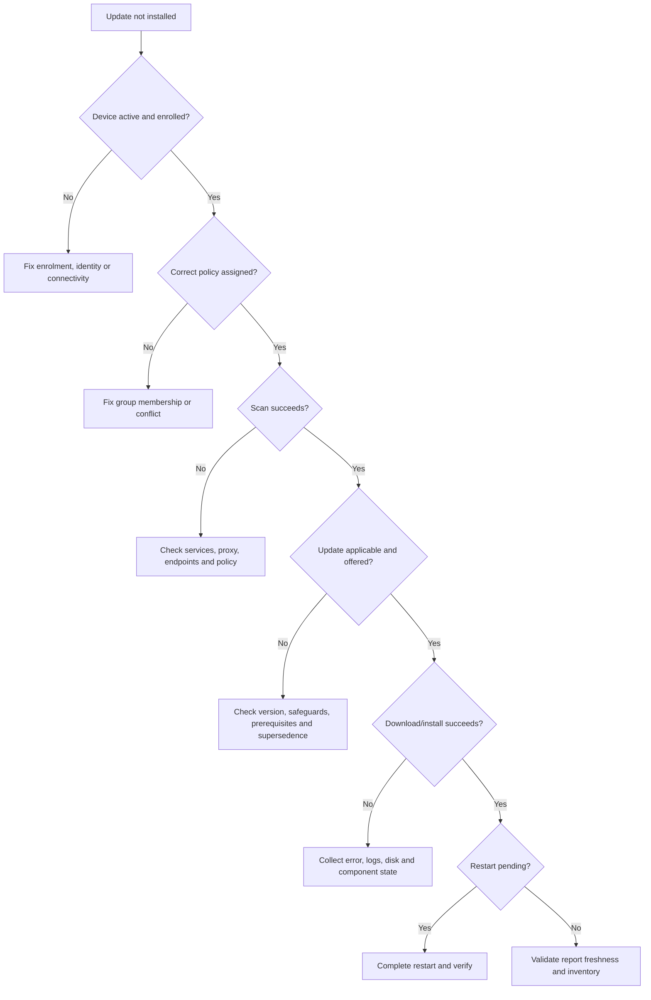

<div align="center">

# 🛠️ Troubleshooting Windows Updates

[](../README.md) [](../scripts/)

**Policy • Scan • Download • Install • Restart • Reporting**

[⬅️ Reporting](./07-reporting-monitoring.md) • [🏠 Home](../README.md) • [➡️ Best Practices](./09-best-practices.md)

</div>

---

## 🧭 Troubleshooting Flow



---

## 1️⃣ Confirm Device Health

```powershell
Get-ComputerInfo | Select-Object WindowsProductName, WindowsVersion, OsBuildNumber
Get-Service wuauserv, bits, usosvc, cryptsvc
Get-PSDrive -PSProvider FileSystem
Get-Date
```

Check that the device:

- Is present and active in Intune
- Has a recent check-in time
- Uses a supported Windows edition and release
- Has adequate free disk space
- Has correct date, time and time zone
- Can reach Microsoft cloud services

---

## 2️⃣ Confirm Policy and Assignment

Review:

- Microsoft Entra group membership
- Include and exclude assignments
- Device versus user targeting
- Update ring overlap
- Feature update policy targeting
- Co-management workload ownership
- Legacy Group Policy or registry settings

Generate a local MDM report:

```powershell
mdmdiagnosticstool.exe -area DeviceEnrollment;DeviceProvisioning;Autopilot -cab C:\Windows\Temp\MDMDiagnostics.cab
```

You can also open:

```text
Settings → Accounts → Access work or school → Connected account → Info
```

---

## 3️⃣ Review Windows Update Evidence

### Event Viewer locations

```text
Applications and Services Logs
└── Microsoft
    └── Windows
        ├── WindowsUpdateClient/Operational
        ├── UpdateOrchestrator/Operational
        ├── DeviceManagement-Enterprise-Diagnostics-Provider/Admin
        └── ModernDeployment-Diagnostics-Provider/Autopilot
```

### Generate Windows Update log

```powershell
Get-WindowsUpdateLog
```

### Recent update history

```powershell
Get-CimInstance -ClassName Win32_QuickFixEngineering |
    Sort-Object InstalledOn -Descending |
    Select-Object -First 20 HotFixID, Description, InstalledOn
```

---

## 4️⃣ Common Failure Areas

| Symptom | Likely areas to investigate |
|---|---|
| Policy not received | Group membership, MDM check-in, assignment filters, conflicts |
| Scan fails | Proxy, firewall, TLS inspection, Windows Update services, legacy policy |
| Update not offered | Applicability, safeguard hold, target version, edition, supersedence |
| Download stuck | BITS, Delivery Optimization, disk space, content endpoint access |
| Installation fails | Component store, pending operations, driver compatibility, disk health |
| Repeated restart request | Servicing completion, pending reboot keys, failed finalisation |
| Intune report stale | Device inactivity, inventory delay, check-in failure |

---

## 5️⃣ Safe Remediation Sequence

1. Restart the device when operationally acceptable.
2. Trigger Intune sync.
3. Confirm Windows Update services are running.
4. Check free space and network access.
5. Run Windows Update troubleshooter where available.
6. Repair system files:

```powershell
DISM.exe /Online /Cleanup-Image /RestoreHealth
sfc.exe /scannow
```

7. Re-scan and collect the exact error code.
8. Escalate with logs, policy evidence, timeline and affected update details.

> [!CAUTION]
> Resetting Windows Update components or deleting servicing data should not be the first action. Collect evidence before destructive remediation.

---

## 📦 Escalation Package

Include:

- Device name, serial number and hardware model
- User impact and business priority
- Windows edition, release and build
- Update KB or feature version
- Exact error code and timestamp
- Assigned policy names
- Intune check-in and report state
- Event logs and MDM diagnostic CAB
- Actions already completed
- Number of affected devices and common pattern

---

## 🔗 Official References

- [Windows Update agent error codes](https://learn.microsoft.com/intune/device-updates/windows/windows-update-agent-error-codes)
- [Intune troubleshooting](https://learn.microsoft.com/troubleshoot/mem/intune/welcome-intune)
- [Windows Update log files](https://learn.microsoft.com/windows/deployment/update/windows-update-logs)

---

<div align="center">

[⬅️ Reporting](./07-reporting-monitoring.md) • [⬆ Back to Top](#%EF%B8%8F-troubleshooting-windows-updates) • [➡️ Best Practices](./09-best-practices.md)

**Maintained by [Xuan Toan Nguyen](https://github.com/toannguyenitoz) • #ToanNguyenITOz**

</div>
